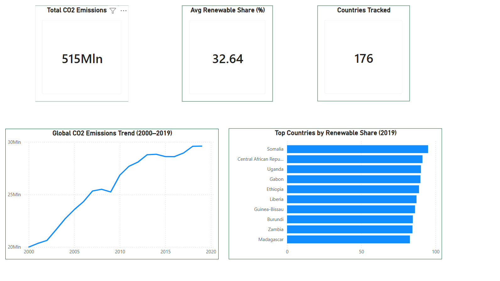
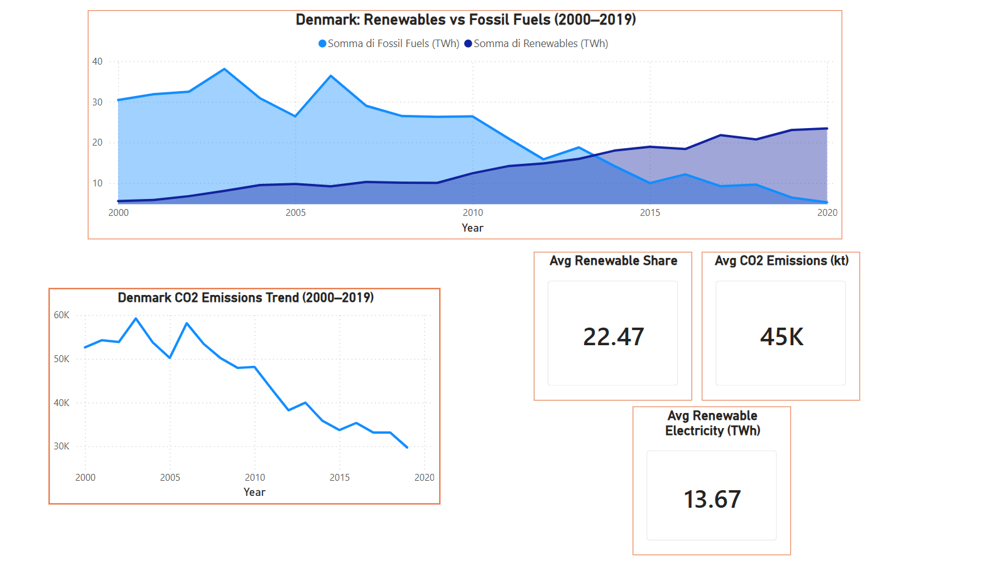
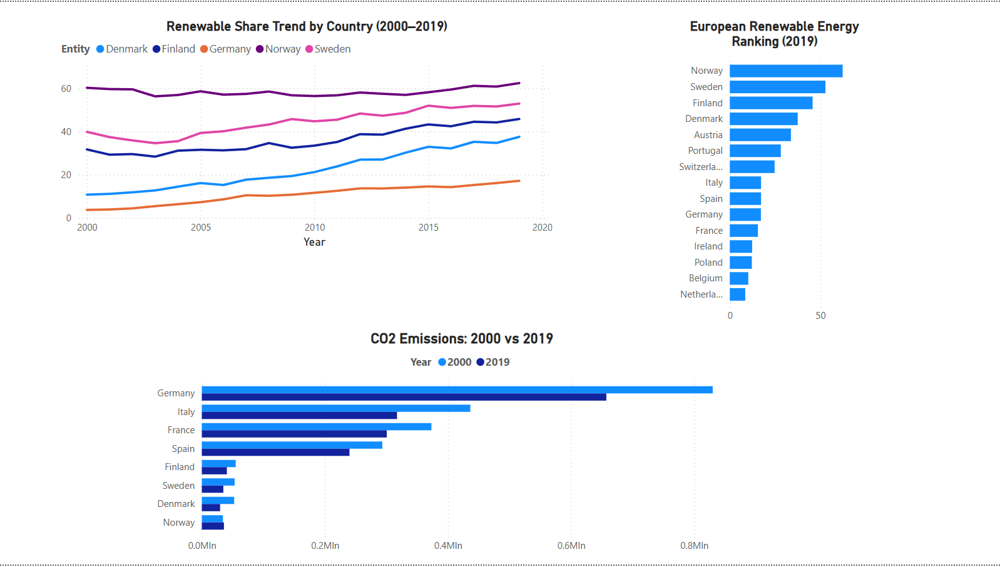
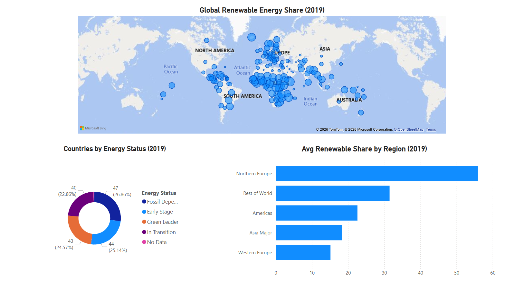

# 🌬️ Denmark Energy Transition Analysis

---

## 📌 Title

**Denmark Energy Transition Analysis (2000–2019)**
*An end-to-end ESG analytics project — from raw data to strategic insights on Denmark's renewable energy journey*

**Tools**: Microsoft Excel · SQL Server (SSMS) · Power BI Desktop
**Dataset**: 3,649 records · 176 countries · 20 years (2000–2019)
**Source**: [Global Data on Sustainable Energy – Kaggle](https://www.kaggle.com/datasets/anshtanwar/global-data-on-sustainable-energy)
**Deliverable**: 4-page interactive Power BI report

---

## 🧭 Executive Summary

This project delivers a comprehensive ESG energy analysis covering 176 countries over 20 years, with a strategic focus on Denmark's renewable energy transition.

Starting from a raw dataset downloaded from Kaggle, the analysis follows a full end-to-end analytics workflow: data quality assessment and cleaning in Excel, structured exploratory analysis in SQL Server, and interactive visualisation in Power BI — culminating in data-driven insights directly relevant to the energy and sustainability sector.

The dashboard is structured across four strategic lenses:

- **Global Overview** → Where does the world stand on renewable energy and CO2 emissions?
- **Denmark Focus** → How has Denmark transformed its energy mix over 20 years?
- **European Comparison** → How does Denmark rank against its European peers?
- **Global Energy Status** → How are countries categorised by energy transition stage?

Key finding: Denmark achieved the **largest CO2 reduction among major European economies (-43.5% from 2000 to 2019)**, while simultaneously tripling its renewable energy share — demonstrating that economic growth and decarbonisation are not mutually exclusive.

---

## ❓ Business Problem

The global energy transition is one of the defining challenges of the 21st century. As countries commit to net-zero targets, organisations in the energy, sustainability, and corporate sectors need data-driven intelligence to benchmark performance, identify leaders, and understand transition trajectories.

This project addresses four core analytical questions:

**1. Global Baseline**
> *Where does the world stand on renewable energy adoption, and which countries are leading the transition?*

**2. Denmark's Transition**
> *How has Denmark's energy mix evolved over 20 years, and what does the data reveal about the pace of decarbonisation?*

**3. European Benchmarking**
> *How does Denmark compare to its Scandinavian peers and major European economies in terms of renewable share and CO2 reduction?*

**4. Global Categorisation**
> *How can countries be segmented by energy transition stage to identify patterns and opportunities at scale?*

---

## 📐 Methodology

### Phase 1 — Data Cleaning & Preparation (Excel)

The raw dataset presented several data quality issues, each systematically resolved:

| Issue | Solution |
|---|---|
| CSV separator set to `;` instead of `,` | Converted using Excel "Text to Columns" with semicolon delimiter |
| Scientific notation conversion prompt on open | Selected "Do not convert" to preserve numeric precision |
| Two columns with >55% missing values | Excluded: `Financial flows to developing countries` and `Renewables (% equivalent primary energy)` |
| Duplicate check on Entity + Year | Verified via "Remove Duplicates" — no duplicates found |
| NULL values in remaining columns (6-25%) | Retained intentionally — rows with partial NULLs still contain valid data for other columns. Dropping all incomplete rows would have eliminated hundreds of valid observations (e.g. a Denmark 2005 row with missing GDP but complete renewable/CO2 data). NULLs are handled at query level with IS NOT NULL filters applied only when the specific column is needed for analysis.

**Data Quality Decision — documented transparently:**
> *2019 was used as the reference year for cross-country comparisons due to near-complete data coverage (174/175 countries). The year 2020 was excluded as a reference point due to critically incomplete coverage (only 1 country recorded), likely reflecting publication lag at dataset creation.*

---

### Phase 2 — Exploratory Data Analysis (SQL Server)

All analytical questions were addressed through structured SQL queries in SSMS before building the dashboard. Below are the 6 queries used, each targeting a specific business question.

---

#### Query 1 — Top 10 Global Renewable Leaders (2019)
*Business question: Who are the world's leading countries by renewable energy share?*

```sql
SELECT TOP 10
    Entity,
    ROUND(Renewable_energy_share_in_the_total_final_energy_consumption, 2) AS renewable_share_pct,
    ROUND(Value_co2_emissions_kt_by_country, 0) AS co2_emissions_kt,
    ROUND(Electricity_from_renewables_TWh, 2) AS electricity_renewables_TWh
FROM sustainable_energy
WHERE Year = 2019
    AND Renewable_energy_share_in_the_total_final_energy_consumption IS NOT NULL
ORDER BY renewable_share_pct DESC
```

**Finding:** Top renewable share countries are predominantly Sub-Saharan African nations (Somalia 95%, Uganda 90%, Ethiopia 88%). However, this reflects reliance on traditional biomass (wood, charcoal) rather than modern green infrastructure — highlighting the importance of analysing electricity source mix alongside aggregate renewable share.

---

#### Query 2 — Denmark Energy Transition (2000–2019)
*Business question: How has Denmark's energy mix evolved over two decades?*

```sql
SELECT
    Year,
    ROUND(Renewable_energy_share_in_the_total_final_energy_consumption, 2) AS renewable_share_pct,
    ROUND(Electricity_from_renewables_TWh, 2) AS electricity_renewables_TWh,
    ROUND(Electricity_from_fossil_fuels_TWh, 2) AS electricity_fossil_TWh,
    ROUND(Value_co2_emissions_kt_by_country, 0) AS co2_emissions_kt
FROM sustainable_energy
WHERE Entity = 'Denmark'
    AND Year BETWEEN 2000 AND 2019
ORDER BY Year ASC
```

**Finding:** Denmark's renewable share grew from 10.7% (2000) to 37.5% (2019), while fossil fuel electricity collapsed from 30.4 TWh to 6.4 TWh (-79%) and CO2 emissions dropped from 52,600 kt to 29,700 kt (-43.5%).

---

#### Query 3 — Denmark vs Scandinavian Peers
*Business question: How does Denmark compare to neighbouring countries at key milestones?*

```sql
SELECT
    Entity,
    Year,
    ROUND(Renewable_energy_share_in_the_total_final_energy_consumption, 2) AS renewable_share_pct,
    ROUND(Value_co2_emissions_kt_by_country, 0) AS co2_emissions_kt
FROM sustainable_energy
WHERE Entity IN ('Denmark', 'Sweden', 'Norway', 'Finland', 'Germany')
    AND Year IN (2000, 2005, 2010, 2015, 2019)
    AND Renewable_energy_share_in_the_total_final_energy_consumption IS NOT NULL
ORDER BY Entity, Year
```

**Finding:** Norway and Sweden lead in absolute renewable share thanks to hydropower. Denmark, however, shows the strongest growth rate among all peers — from the lowest base (10.7%) to 37.5% — a +250% increase relative to its 2000 baseline, uniquely driven by wind energy rather than hydropower.

---

#### Query 4 — Country Categorisation with CASE WHEN
*Business question: How can countries be segmented by energy transition stage and region?*

```sql
SELECT
    Entity,
    Year,
    ROUND(Renewable_energy_share_in_the_total_final_energy_consumption, 2) AS renewable_share_pct,
    ROUND(Value_co2_emissions_kt_by_country, 0) AS co2_emissions_kt,
    CASE
        WHEN Entity IN ('Denmark','Sweden','Norway','Finland','Iceland') THEN 'Northern Europe'
        WHEN Entity IN ('Germany','France','Italy','Spain','Netherlands','Belgium','Austria','Switzerland') THEN 'Western Europe'
        WHEN Entity IN ('China','India','Japan','South Korea') THEN 'Asia Major'
        WHEN Entity IN ('United States','Canada','Brazil','Mexico') THEN 'Americas'
        ELSE 'Rest of World'
    END AS Region,
    CASE
        WHEN Renewable_energy_share_in_the_total_final_energy_consumption >= 50 THEN 'Green Leader'
        WHEN Renewable_energy_share_in_the_total_final_energy_consumption >= 25 THEN 'In Transition'
        WHEN Renewable_energy_share_in_the_total_final_energy_consumption >= 10 THEN 'Early Stage'
        ELSE 'Fossil Dependent'
    END AS energy_status
FROM sustainable_energy
WHERE Year = 2019
    AND Renewable_energy_share_in_the_total_final_energy_consumption IS NOT NULL
ORDER BY renewable_share_pct DESC
```

**Finding:** 47 countries (26.86%) are classified as "Early Stage", while 44 (25.14%) remain "Fossil Dependent". Major oil-producing nations (Saudi Arabia 0.03%, Qatar 0.04%, Kuwait 0.06%) sit at the bottom of the global ranking.

---

#### Query 5 — European Ranking with Window Function
*Business question: What is Denmark's precise rank within Europe?*

```sql
SELECT
    Entity,
    ROUND(Renewable_energy_share_in_the_total_final_energy_consumption, 2) AS renewable_share_pct,
    ROUND(Value_co2_emissions_kt_by_country, 0) AS co2_emissions_kt,
    RANK() OVER (ORDER BY Renewable_energy_share_in_the_total_final_energy_consumption DESC) AS european_rank
FROM sustainable_energy
WHERE Year = 2019
    AND Entity IN (
        'Denmark','Sweden','Norway','Finland','Germany',
        'France','Italy','Spain','Netherlands','Belgium',
        'Austria','Switzerland','Portugal','Poland','Ireland'
    )
    AND Renewable_energy_share_in_the_total_final_energy_consumption IS NOT NULL
ORDER BY european_rank
```

**Finding:** Denmark ranks **4th in Europe** (37.52%), with the lowest CO2 emissions among the top 5 — outperforming significantly larger economies such as Germany (10th, 17.17%) and France (12th, 15.53%) despite being a fraction of their size and industrial output.

---

#### Query 6 — CO2 Reduction Leaders 2000–2019
*Business question: Which countries achieved the greatest decarbonisation over 20 years?*

```sql
SELECT
    Entity,
    MIN(CASE WHEN Year = 2000 THEN ROUND(Value_co2_emissions_kt_by_country, 0) END) AS co2_2000,
    MIN(CASE WHEN Year = 2019 THEN ROUND(Value_co2_emissions_kt_by_country, 0) END) AS co2_2019,
    MIN(CASE WHEN Year = 2000 THEN ROUND(Renewable_energy_share_in_the_total_final_energy_consumption, 2) END) AS renewable_2000,
    MIN(CASE WHEN Year = 2019 THEN ROUND(Renewable_energy_share_in_the_total_final_energy_consumption, 2) END) AS renewable_2019,
    ROUND(
        (MIN(CASE WHEN Year = 2019 THEN Value_co2_emissions_kt_by_country END) -
         MIN(CASE WHEN Year = 2000 THEN Value_co2_emissions_kt_by_country END)) /
         NULLIF(MIN(CASE WHEN Year = 2000 THEN Value_co2_emissions_kt_by_country END), 0) * 100
    , 1) AS co2_change_pct
FROM sustainable_energy
WHERE Entity IN ('Denmark','Sweden','Norway','Finland','Germany','France','Italy','Spain')
    AND Year IN (2000, 2019)
GROUP BY Entity
ORDER BY co2_change_pct ASC
```

**Finding:** Denmark leads European decarbonisation with -43.5% CO2 reduction (2000–2019), followed by Sweden (-34.3%) and Italy (-27.3%). Norway is the only country with increasing emissions (+4.8%), a paradox explained by industrial growth tied to its oil sector despite high renewable share from hydropower.

---

### Phase 3 — Interactive Dashboard (Power BI Desktop)

Built a 4-page Power BI report with cross-page interactivity. Data source: direct SQL Server connection (Import mode — data embedded in .pbix for portability).

Two calculated columns added in Power Query:

| Column | Logic |
|---|---|
| `Region` | M formula classifying countries into 5 macro-regions |
| `Energy_Status` | M formula classifying countries into 4 transition stages (Green Leader / In Transition / Early Stage / Fossil Dependent / No Data) |

---

## 📊 Dashboard Pages

### Page 1 — Global Overview
**Purpose:** Establish the global context before zooming into Denmark.

| Visual | Type | Key Insight |
|---|---|---|
| Total CO2 Emissions (kt) | KPI Card | 515Mln kt cumulative 2000–2019 |
| Avg Renewable Share (%) | KPI Card | 32.64% global average |
| Countries Tracked | KPI Card | 176 countries |
| Global CO2 Emissions Trend | Line Chart | Steady increase globally despite renewable growth |
| Top Countries by Renewable Share (2019) | Bar Chart | Top 10 dominated by biomass-dependent nations |


---

### Page 2 — Denmark Focus
**Purpose:** Deep-dive into Denmark's 20-year energy transformation.

| Visual | Type | Key Insight |
|---|---|---|
| Renewables vs Fossil Fuels (TWh) | Area Chart | Lines cross ~2013–2014: renewables overtake fossil fuels |
| CO2 Emissions Trend | Line Chart | Consistent decline from 52,600 kt to 29,700 kt |
| Avg Renewable Share (%) | KPI Card | 22.47% average over 20 years |
| Avg CO2 Emissions (kt) | KPI Card | 45K kt average |
| Avg Renewable Electricity (TWh) | KPI Card | 13.67 TWh average |


---

### Page 3 — European Comparison
**Purpose:** Benchmark Denmark against 15 major European economies.

| Visual | Type | Key Insight |
|---|---|---|
| European Renewable Energy Ranking (2019) | Bar Chart | Denmark 4th, outperforming Germany and France |
| Renewable Share Trend by Country (2000–2019) | Line Chart | Denmark shows steepest growth curve among peers |
| CO2 Emissions: 2000 vs 2019 | Clustered Bar | Denmark smallest absolute CO2 among all 8 countries |
| Country Filter | Slicer (dropdown) | Interactive — user can add/remove any country |


---

### Page 4 — Global Energy Status
**Purpose:** Macro-level view of the global energy transition landscape.

| Visual | Type | Key Insight |
|---|---|---|
| Global Renewable Energy Share (2019) | Map (bubble) | Africa and South America most visually dominant |
| Countries by Energy Status (2019) | Donut Chart | Nearly even split across 4 categories |
| Avg Renewable Share by Region (2019) | Bar Chart | Northern Europe leads (55%+); Western Europe last among named regions |


---

## 📈 Key Findings & Strategic Insights

### Finding 1 — Denmark is Europe's fastest decarboniser

**Data says:**
Denmark reduced CO2 by **-43.5%** between 2000 and 2019 — the largest reduction among all major European economies analysed, ahead of Sweden (-34.3%), Italy (-27.3%) and Germany (-20.8%).

**Strategic insight:**
> Denmark's decarbonisation is not the result of deindustrialisation or reduced energy demand — it reflects a deliberate and sustained investment in wind energy infrastructure. This makes Denmark a replicable model for other mid-sized economies seeking to decouple economic growth from carbon emissions.

---

### Finding 2 — The crossover moment: 2013–2014

**Data says:**
Denmark's renewable electricity (TWh) surpassed fossil fuel electricity for the first time around **2013–2014**, a structural shift visible in the area chart on Page 2.

**Strategic insight:**
> This crossover represents a point of no return in Denmark's energy transition — renewable capacity became self-sustaining and cost-competitive with fossil fuels. The years 2010–2014 were the critical investment window that enabled this shift.

---

### Finding 3 — High renewable share ≠ modern green infrastructure

**Data says:**
The global Top 10 by renewable share in 2019 consists entirely of Sub-Saharan African nations (Somalia 95%, Uganda 90%, Ethiopia 88%), yet these countries have near-zero renewable electricity generation (TWh).

**Strategic insight:**
> Aggregate renewable share metrics must be interpreted alongside electricity source data. High share in low-income countries typically reflects biomass dependency, not wind or solar deployment. A 'No Data' category was retained in the Energy Status visualisation to transparently communicate data coverage limitations — reflecting data integrity principles.

---

### Finding 4 — Western Europe underperforms its reputation

**Data says:**
Western Europe (Germany, France, Italy, Spain, Netherlands) ranks **last among all defined regions** in average renewable share (2019), behind Northern Europe, Rest of World, Americas and Asia Major.

**Strategic insight:**
> Despite significant policy frameworks (EU Green Deal, national renewable targets), Western Europe's large fossil fuel legacy infrastructure creates structural inertia. Germany's low position (17.17%) despite its Energiewende policy highlights the gap between political ambition and statistical reality within a 20-year window.

---

## 🛠️ Skills Demonstrated

**Data Analytics**
- ✅ End-to-end pipeline: raw CSV → Excel cleaning → SQL analysis → Power BI dashboard
- ✅ Data quality assessment with documented inclusion/exclusion decisions
- ✅ Reference year selection based on data coverage analysis
- ✅ NULL handling strategy at query level (IS NOT NULL filters)

**SQL Server (SSMS)**
- ✅ Filtering, aggregation and sorting (WHERE, GROUP BY, ORDER BY)
- ✅ Multi-year comparative analysis with IN clause
- ✅ CASE WHEN for country categorisation and regional segmentation
- ✅ RANK() OVER — Window Function for European ranking
- ✅ Conditional aggregation with CASE WHEN inside MIN()
- ✅ NULLIF() for safe percentage change calculation

**Business Intelligence**
- ✅ Direct SQL Server connection to Power BI (Import mode)
- ✅ Calculated columns in Power Query (M language)
- ✅ Multi-page dashboard with cross-page slicer interactivity
- ✅ KPI Cards, Area Chart, Line Chart, Bar Chart, Donut Chart, Map
- ✅ ESG-oriented data storytelling for sustainability audiences

**Critical Thinking**
- ✅ Identification of biomass vs modern renewables distinction
- ✅ Norway CO2 paradox analysis (high renewables + rising emissions)
- ✅ Transparent communication of data limitations (No Data category retained)
- ✅ Business-oriented insight framing aligned with ESG sector needs

---

## 📁 Repository Structure

```
denmark-energy-transition/
│
├── sustainable_energy_clean.csv       # Cleaned dataset (Excel-processed)
│
├── denmark-energy-transition.pbix     # Power BI dashboard (data embedded)
│
├── screenshots/
│   ├── 01_global_overview.png
│   ├── 02_denmark_focus.png
│   ├── 03_european_comparison.png
│   └── 04_global_energy_status.png
│
└── README.md
```

---

## 🚀 How to Open the Dashboard

1. Download and install [Power BI Desktop](https://powerbi.microsoft.com/desktop/) (free)
2. Clone or download this repository
3. Open `denmark-energy-transition.pbix` in Power BI Desktop
4. All data is embedded — no external database connection required

---

*Developed by Bilel Ben Boulaares | Università degli Studi di Modena e Reggio Emilia | 2026*
*📧 [bbenboulaaresbilel@gmail.com](mailto:bbenboulaaresbilel@gmail.com) | 🔗 [linkedin.com/in/bilel-ben-boulaares-15702b374](https://www.linkedin.com/in/bilel-ben-boulaares-15702b374/)*
